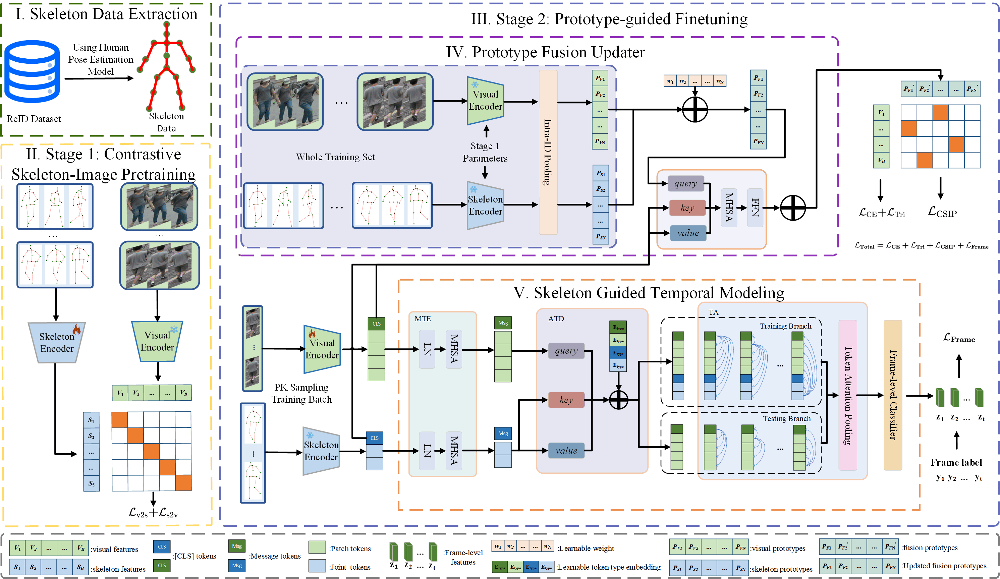

<div align="center">

  <h1 align="center">Skeletons Speak Louder than Text: A Motion-Aware Pretraining Paradigm for Video-Based Person Re-Identification</h1>

### [[`arxiv`](https://arxiv.org/pdf/2511.13150)][[`Paper`](https://arxiv.org/pdf/2511.13150)]
</div>

Official implementation of "Skeletons Speak Louder than Text: A Motion-Aware Pretraining Paradigm for Video-Based Person Re-Identification". Our paper has been accepted by AAAI2026.

## 🌟 Overview

We propose **CSIP-ReID**, the first skeleton-driven pre-training framework for video-based ReID that learns from paired skeleton–image sequences. Unlike prior works that reuse CLIP encoders, our method performs genuine multimodal pretraining on ReID data, establishing a new paradigm beyond text-based approaches.

<div align=center>

</div>

## 🛠️ Installation

```bash
# Clone repository
git clone https://github.com/Rifen-Lin/CSIP-ReID.git
cd CSIP-ReID

# Create conda environment
conda create -n CSIP-ReID python=3.8
conda activate CSIP-ReID
pip install -r ./requirements.txt
```

## 🚀 Getting Started

### Step 1: Data Preparation


(1) Download the datasets (MARS, LS-VID and iLIDS-VID) and then unzip them.

(2) Extract skeleton from ReID datasets and put them in the folder:
```
- datasets
   - mars
      - bbox_train
         - 0001
            - 0001C1T0001F001.jpg
      - bbox_test
      - skeleton_3d
         - bbox_train
            - 0001
               - 0001C1T0001F001.json
         - bbox_test
   - iLIDS-VID
   - LS-VID
```


### Step 2: Model Training
CSIP-ReID consists of two stages: Contrastive Skeleton-Image Pretraining and Prototype-guided Finetuning.

Taking the Mars dataset as an example, begin with the Stage1 training:
```
python train_stage1.py --config_file ./configs/mars/config_stage1.yml
```
After finishing Stage1 training, load the model weights from Stage1 and begin training Stage2:
```
python train_stage2.py --config_file ./configs/mars/config_stage2.yml
```

### Step 3: Model Evaluation
Load the model weights saved in Stage2 and start evaluation:
```
python test.py --config_file ./configs/mars/test.yml
```

## 💖  Acknowledgements

This project is based on [CLIP-ReID](https://github.com/Syliz517/CLIP-ReID) and [TF-CLIP](https://github.com/AsuradaYuci/TF-CLIP).
Special thanks to these works for making their excellent codebase publicly available.

If we missed any open-source projects or related articles, we would like to complement the acknowledgement of this specific work immediately.


## 📒 Citation

If you use CSIP-ReID in your research, please cite our paper:

```
@misc{lin2025skeletonsspeakloudertext,
      title={Skeletons Speak Louder than Text: A Motion-Aware Pretraining Paradigm for Video-Based Person Re-Identification}, 
      author={Rifen Lin and Alex Jinpeng Wang and Jiawei Mo and Min Li},
      year={2025},
      eprint={2511.13150},
      archivePrefix={arXiv},
      primaryClass={cs.CV},
      url={https://arxiv.org/abs/2511.13150}, 
}
```